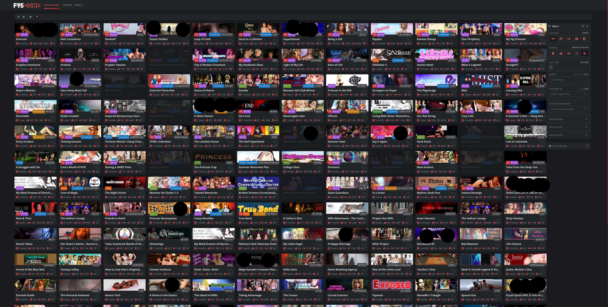

# Ultimate-F95Zone
Ultimate F95Zone

A UserScript designed to enhance and modernize the browsing experience on the F95zone "Latest Games & Updates" page (`/sam/latest_alpha/`).

## Overview

This script aims to provide a more spacious, customizable, and user-friendly layout for viewing game and comic updates on F95zone. It started as a simple CSS redesign and has evolved to include dynamic content loading with infinite scroll and attempts to maintain compatibility with the site's own JavaScript features.

## Features

*   **Dynamic Wider Layout:**
    *   Utilizes more screen real estate by dynamically expanding the main content area (`.p-body-inner`) to 95% of the **current browser viewport width** using JavaScript (`window.innerWidth`).
    *   Adjusts on page load and on window resize for a consistently spacious view.
*   **Enhanced Item Grid:**
    *   Dynamically adjusts the number of items per row (`grid-template-columns: repeat(auto-fit, minmax(250px, 1fr))`) for a responsive feel within the wider layout.
    *   Aims to make individual entries appear larger and fill out more horizontal space.
*   **Infinite Scrolling:** Automatically loads the next set of items as you scroll down, replacing the need for manual pagination.
    *   Fetches data from the site's `latest_data.php` AJAX endpoint.
    *   Parses JSON response and dynamically creates new item tiles.
*   **Unread Link Highlighting:** Makes "Jump to new" links and similar unread indicators more prominent with custom styling (cyan, bold).
*   **Clean UI:** Hides certain elements like the extended footer, section links, and original pagination controls for a cleaner look.
*   **Compatibility Efforts:**
    *   Attempts to replicate the site's DOM structure for new items to ensure compatibility with the site's own JavaScript (`latest.min.js`), including hover effects and tooltips (via `XF.activate`).
    *   Parses URL hash for current page and filter state.
    *   Resets infinite scroll state when site-initiated filter changes are detected.

## Why this script?

The default F95zone "Latest Updates" page can feel a bit cramped, especially on wider screens. This script provides:
*   A more modern, spacious browsing experience.
*   Better utilization of screen width.
*   The convenience of infinite scrolling.

## Requirements

*   A modern web browser (e.g., Chrome, Firefox, Edge).
*   A UserScript manager extension:
    *   [Tampermonkey](https://www.tampermonkey.net/) (Recommended for Chrome, Edge, Safari, Opera)
    *   [Violentmonkey](https://violentmonkey.github.io/) (Recommended for Firefox, Chrome, Edge)
    *   [Greasemonkey](https://www.greasespot.net/) (Firefox - older, might have compatibility differences)

## Installation

1.  Ensure you have a UserScript manager installed in your browser.
2.  Click on the "Raw" button for the `Ultimate-F95Zone.user.js` file in this repository (or use the direct install link if provided, e.g., from GreasyFork).
3.  Your UserScript manager should automatically open a new tab asking if you want to install the script.
4.  Review the script's permissions (it should only need access to `f95zone.to`) and click "Install".
5.  The script will automatically run when you visit URLs matching `https://f95zone.to/sam/latest_alpha/*`.

## Usage

Once installed, the script works automatically when you navigate to the F95zone "Latest Games & Updates" alpha page.
*   Scroll down the page, and new items should load automatically.
*   The layout will be wider, and the item grid should adjust to your screen width.
*   "Jump to new" links will be highlighted.

## Configuration

Currently, most settings are hardcoded within the script:

*   **Items per Row (Grid Density):** Controlled by `minmax(250px, 1fr)` in the CSS for `.grid-normal`. Lowering `250px` will fit more, smaller items per row.
*   **Items per AJAX Load:** The script attempts to use the site's default (often 90, configurable via `itemsPerRow` variable if `latestUpdates.options` is not found).
*   **Initial Page Load Delay:** A 3-second `setTimeout` is used before initializing infinite scroll to allow the site's own JavaScript to load initial content. This can be adjusted in the script.

Future versions might include a settings panel using `GM_setValue`/`GM_getValue` for easier customization.

## Technical Details

*   The script injects custom CSS to achieve the redesigned layout for item grids and other elements.
*   **Dynamic Page Width:** It uses JavaScript to find the `.p-body-inner` element and sets its `max-width` style property to 95% of `window.innerWidth`. This calculation is also re-applied if the browser window is resized.
*   Infinite scrolling is implemented using an `IntersectionObserver` on a trigger element.
*   New item data is fetched from `https://f95zone.to/sam/latest_alpha/latest_data.php` by mimicking the site's AJAX request parameters (cmd, cat, page, sort, rows, _).
*   The JSON response is parsed, and new DOM elements for tiles are created by the `createItemElement` function. This function is critical and aims to replicate the DOM structure of tiles generated by F95zone's own `latest.min.js` to ensure compatibility with site features (hover galleries, tooltips).
*   It attempts to call `XF.activate(element)` on newly added tiles to trigger XenForo's JavaScript initializations.
*   A `MutationObserver` watches for content changes in the item container to reset infinite scroll state if filters are applied by the user through the site's UI.

## Known Issues & Limitations

*   **`offsetWidth` Error from `latest.min.js`:** You may still encounter a `TypeError` related to `offsetWidth` in the console when hovering over dynamically loaded items. This occurs if the DOM structure generated by `createItemElement` doesn't perfectly match what `latest.min.js` expects for its hover effects (like title animation or image galleries). Meticulous comparison and adjustment of `createItemElement` are needed to resolve this fully.
*   **Image Loading (ERR_BLOCKED_BY_CLIENT / ERR_HTTP2_PROTOCOL_ERROR):**
    *   `ERR_BLOCKED_BY_CLIENT`: If you use an ad blocker or privacy extension, it might block images from `preview.f95zone.to`. You will need to whitelist this domain in your extension.
    *   `ERR_HTTP2_PROTOCOL_ERROR`: This is a network-level error and might be due to server issues, your connection, or browser hiccups, generally outside the script's direct control.
*   **Hover Effects on Dynamic Items:** While `XF.activate()` is called, not all JavaScript-driven hover effects (especially the image gallery preview built by `latest.min.js`) might work perfectly on items loaded by the UserScript if the DOM isn't an exact match or if `latest.min.js` doesn't re-bind its specific hover handlers to new elements.
*   **Prefix Display:** Full prefix rendering (engine, status, etc.) with correct styling in `createItemElement` is complex as it requires mapping prefix IDs from the JSON data to names and CSS classes (potentially from the site's `latestUpdates.prefixes` global variable). This is currently basic in the provided `createItemElement` template.
*   **Ad Blocker Interactions:** Besides image blocking, aggressive ad blockers could potentially interfere with the script's AJAX requests or DOM manipulations, though this script tries to use standard methods.

## Future Enhancements (Potential Roadmap)

*   Perfect the `createItemElement` DOM structure to eliminate `offsetWidth` errors and ensure full compatibility with `latest.min.js` hover effects.
*   Implement robust prefix rendering with correct styling.
*   Add a settings panel using `GM_setValue` and `GM_getValue` for user-configurable options (e.g., items per row density, items per AJAX load).
*   More robust handling of filter changes and state synchronization.
*   Option to disable the 3-second initial timeout and use a more dynamic wait for initial content (e.g., refined MutationObserver).

## Contributing

Contributions, bug reports, and suggestions are welcome! Please feel free to open an issue or submit a pull request.
When reporting bugs, please include:
*   Browser and UserScript Manager version.
*   Steps to reproduce the issue.
*   Any console errors.
*   Screenshots if applicable.

## Author

*   **balu100**

---

Happy browsing!
